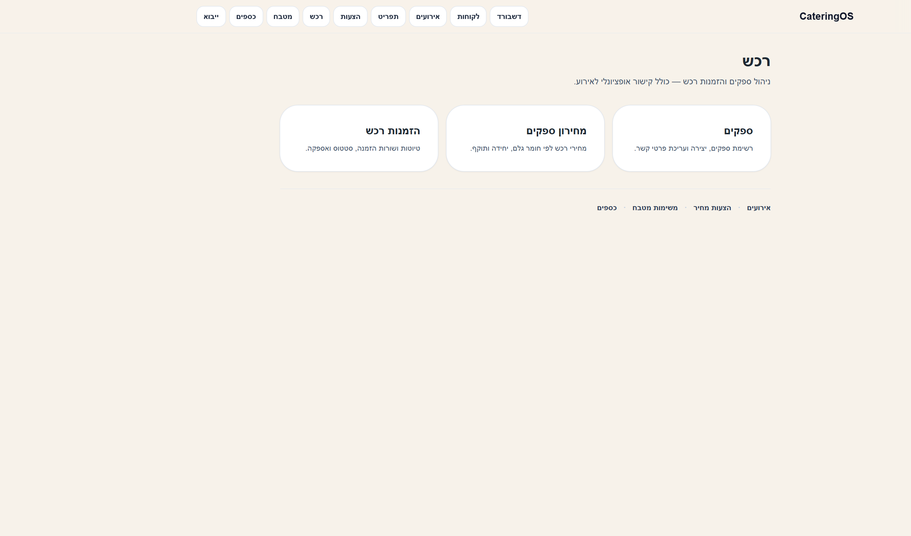
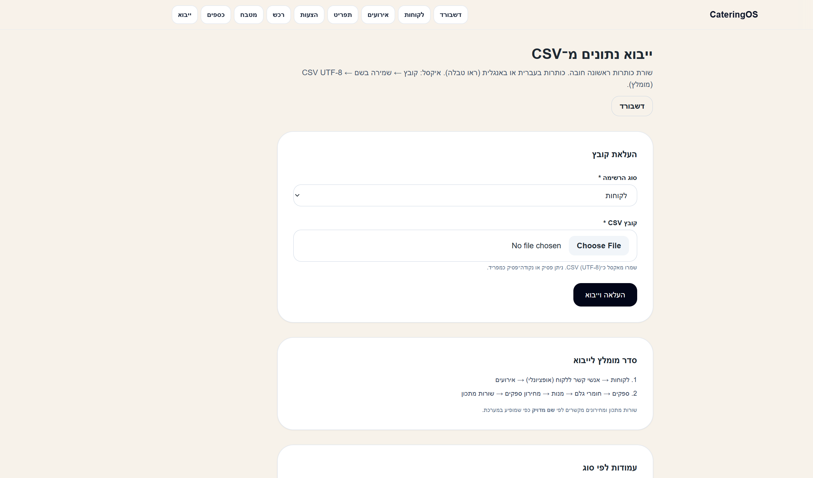

# מדריך משתמש — CateringOS

> גרסה מקוצרת. **מדריך מלא עם צילומי מסך:** פתחו במערכת את [`/guide`](http://localhost:3000/guide).

---

## 1. כניסה למערכת

1. פתחו את כתובת המערכת בדפדפן.
2. אם מופיעה שגיאה — ודאו PostgreSQL פועל ו־`DATABASE_URL` מוגדר (ראו README).


---

## 2. ניווט

| כפתור | תפקיד |
|--------|--------|
| דשבורד | מסך הבית |
| לקוחות | ניהול לקוחות |
| אירועים | אירועים לפי תאריך |
| תפריט | מנות, חומרי גלם, מתכון |
| הצעות | הצעות מחיר |
| רכש | ספקים, מחירון, הזמנות |
| מטבח | משימות הכנה |
| כספים | תשלומים |
| ייבוא | טעינת CSV |
| מדריך | עמוד זה במערכת |

---

## 3. זרימת עבודה (מקצה לקצה)

```
לקוח → אירוע → תפריט (מנות + מתכון + מחירון) → הצעת מחיר → אישור
  → משימות מטבח (אוטומטי) → רכש → תשלום
```

1. **לקוח** — שם + טלפון (חובה).
2. **אירוע** — תאריך, מוזמנים, רמת שירות.
3. **תפריט** — מנות, חומרי גלם, שורות מתכון (יחידות: ק״ג, **גרם**, ליטר…).
4. **מחירון** — רכש → מחירון ספקים.
5. **הצעה** — שורות מנות; סטטוס **«אושרה»** יוצר משימות מטבח.
6. **מטבח / רכש / כספים** — לפי הצורך.

---

## 4. חישוב עלות

- בעמוד **עריכת מנה** — קטע «עלות משוערת לפי מחירון ספקים».
- ב**הצעת מחיר** — עמודת «הערכת עלות» + סיכום בסרגל.
- דורש: מתכון + מחירון (יחידת מחיר = יחידה במתכון).

---

## 5. רכש



- **ספקים** — רשימה ויצירה.
- **מחירון** — מחיר לפי ספק + חומר + יחידה.
- **הזמנות** — טיוטות ושורות; קישור לאירוע אופציונלי.

---

## 6. משימות מטבח (אוטומטי)

כש**הצעה מאושרת** ויש בה מנות:

- נוצרת משימה לכל מנה (כמות מסוכמת).
- תאריך עבודה = תאריך האירוע.
- הערה מתחילה ב־`[אוטו-הזמנה]`.
- צפייה: **מטבח** או **עמוד האירוע**.

---

## 7. ייבוא CSV מאקסל



1. **ייבוא** בסרגל.
2. אקסל: קובץ → שמירה בשם → **CSV UTF-8**.
3. בחרו סוג רשימה והעלו קובץ (שורה 1 = כותרות).
4. **סדר מומלץ:** לקוחות → אירועים; ספקים → חומרים → מנות → מחירון → מתכון.

שמות (ספק, חומר, מנה) חייבים להתאים **בדיוק** למה שבמערכת.

---

## קישורים מהירים

- מדריך במערכת: `/guide`
- ייבוא: `/data-import`
- README טכני: [README.md](../README.md)
